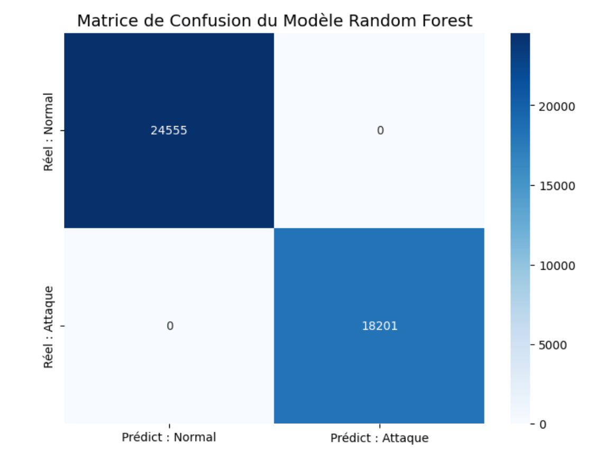
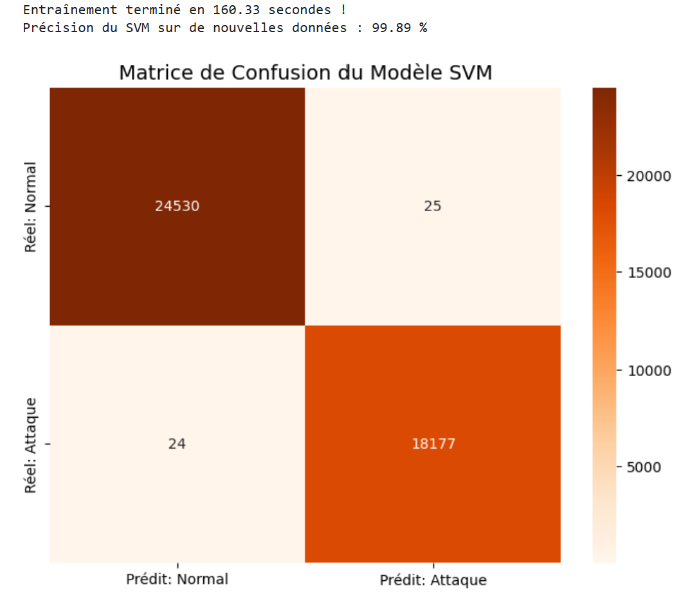

# NIDS-Machine-Learning-Cybersecurity
Détection d'intrusions réseau (NIDS) avec Random Forest et SVM sur le dataset CICIDS2017.

Ce projet implémente un système de détection d'intrusions réseau (NIDS) utilisant des algorithmes d'Intelligence Artificielle pour identifier automatiquement les flux malveillants (attaques DDoS, Scan de ports, etc.).

##  Objectifs
* Traitement et analyse de données réseau massives (Data Engineering).
* Comparaison d'algorithmes de Machine Learning (Random Forest vs SVM Linéaire).
* Évaluation des performances et minimisation des faux positifs.

##  Dataset
Utilisation du dataset public de référence **CICIDS2017** (Canadian Institute for Cybersecurity).
* Fichier analysé : `Friday-WorkingHours-Afternoon-PortScan.pcap_ISCX.csv`
* Volume : + de 280 000 flux réseau analysés.

##  Technologies utilisées
* **Langage :** Python
* **Environnement :** Jupyter Notebook (Google Colab)
* **Librairies :** Pandas, NumPy, Scikit-Learn, Seaborn, Matplotlib

##  Résultats obtenus
* **Random Forest :** Précision de 100% avec 0 faux positif (temps d'entraînement : ~42s).
* **Linear SVM :** Précision de 99.89% avec 25 faux positifs (temps d'entraînement : ~154s).
Le Random Forest s'est révélé être l'algorithme le plus adapté pour ce type d'attaque grâce à sa rapidité et sa précision.

##  Résultats et Évaluation (Matrices de Confusion)

L'évaluation des modèles a été réalisée sur 20% du dataset (soit 42 756 flux réseau). En cybersécurité, l'enjeu principal est de minimiser les **Faux Positifs** (qui saturent les analystes SOC d'alertes inutiles) et les **Faux Négatifs** (qui laissent passer une attaque).

### 1. Modèle Random Forest (Le meilleur choix)

* **Précision :** 100.0 %
* **Temps d'entraînement :** ~42 secondes
* **Analyse :** Le modèle réalise un sans-faute (0 erreur). Cela s'explique par la nature de l'attaque "PortScan" étudiée, qui laisse des signatures réseau très distinctives (numéros de ports ciblés répétés). Les arbres de décision du Random Forest ont pu isoler cette règle mathématique avec une efficacité redoutable.

### 2. Modèle Support Vector Machine (LinearSVC)

* **Précision :** 99.89 %
* **Temps d'entraînement :** ~154 secondes
* **Analyse :** Bien que la précision globale soit excellente, le SVM montre ses limites mathématiques sur ce type de données face au Random Forest :
  * **25 Faux Positifs :** 25 flux légitimes ont été bloqués (impactant potentiellement l'expérience utilisateur).
  * **24 Faux Négatifs :** 24 attaques ont réussi à contourner le système de détection (risque de sécurité).
  * **Temps de calcul :** Près de 4 fois plus lent que le Random Forest, ce qui le rend moins optimal pour un système NIDS censé analyser des millions de paquets en temps réel.

###  Conclusion comparative
Le **Random Forest** s'impose comme la solution idéale pour ce scénario spécifique grâce à son temps de traitement rapide et son absence totale de fausses alertes, des critères cruciaux pour le déploiement d'un NIDS en entreprise.

##  Contenu du dépôt
* `NIDS_MachineLearning_Detection.ipynb` : Le code source complet (nettoyage, normalisation, entraînement et évaluation).
* `Projet-Détection d'anomalies réseau par Machine Learning.pdf` : La présentation complète du projet et l'analyse des résultats.
